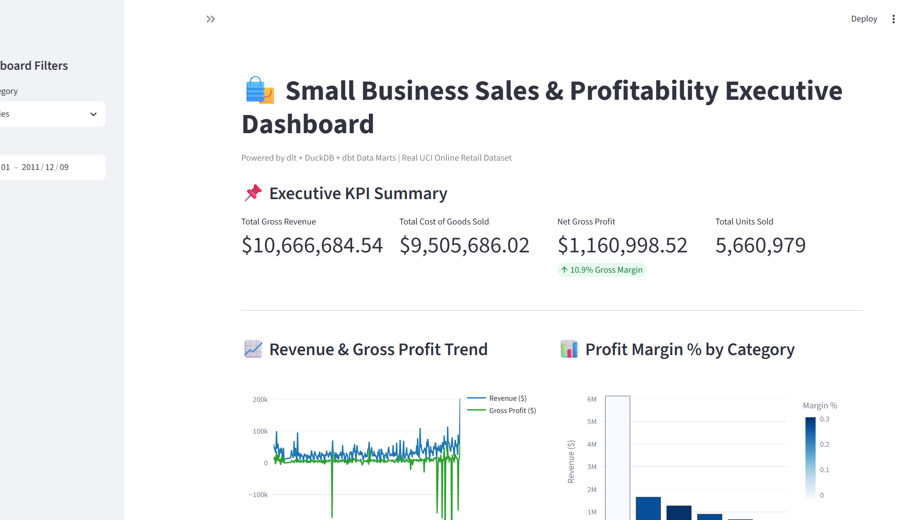
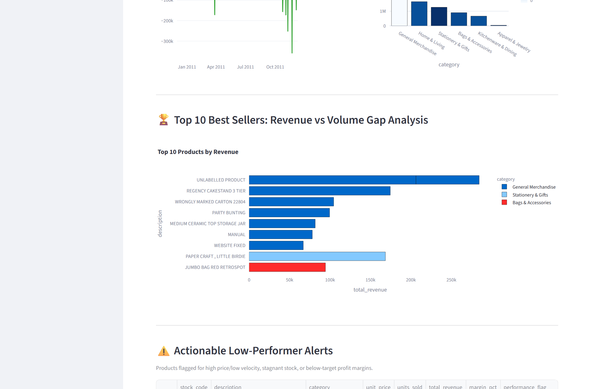
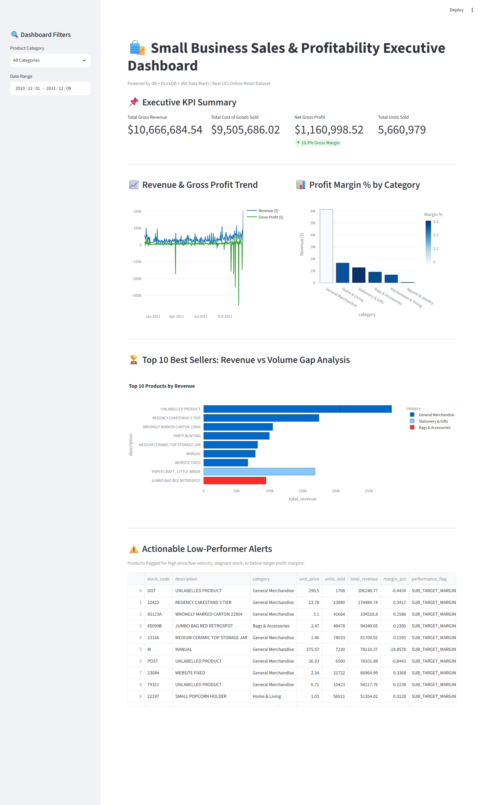
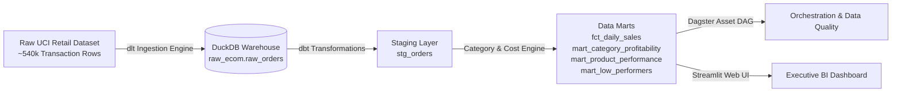

# 🛍️ Small Business E-Commerce Sales & Profitability Pipeline (ELT)

[](https://ecom-sales-profitability.streamlit.app)
[](https://www.getdbt.com/)
[](https://dagster.io/)

> 🚀 **Live Interactive Web App**: [https://ecom-sales-profitability.streamlit.app](https://ecom-sales-profitability.streamlit.app)  
> ⏱️ **Note on Free-Tier Hosting**: *Hosted on Streamlit Community Cloud (Free Tier). If the container has been idle, it may take ~45–60 seconds to spin up on first click. For immediate review without waiting, high-resolution preview screenshots are provided below.*

An end-to-end Data Engineering pipeline and executive BI dashboard built on the **Modern Data Stack** (`dlt`, `DuckDB`, `dbt`, `Dagster`, `Streamlit`, `Docker`). 

Processes real-world e-commerce transaction data (~540,000 order records) to generate business insights around top-line revenue, category profit margins, product rank volume gaps, and actionable low-performer risk alerts.

---

## 📸 Executive Dashboard Previews


*Fig 1: Executive KPI suite ($10.67M Revenue, $1.16M Net Gross Profit, 10.9% Margin), Revenue vs. COGS Trends, and Category Margin % Breakdown.*

<details>
<summary>📊 <b>Click to view Best Seller Volume Gap & Low-Performer Risk Alerts</b></summary>
<br>


*Fig 2: Top 10 Best Sellers Revenue vs. Volume Gap analysis and automated inventory risk alert table.*


*Fig 3: Complete scroll view of analytics dashboard.*

</details>

---

## 🎯 Business Problem & Key Objectives

Traditional sales dashboards only focus on vanity metrics like gross revenue. Small business owners need visibility into **unit profitability** and **actionable inventory signals**:

1. **Executive Revenue & Gross Profit Overview**: Daily & monthly trends of sales vs. Cost of Goods Sold (COGS).
2. **Category Profit Margins**: Breakdown of margin % `(Revenue - Cost) / Revenue` across product lines.
3. **Best vs Worst Seller Rank Gap**: Identifying high-volume low-revenue items vs. high-revenue low-volume items.
4. **Actionable Low-Performer Flags**: Automatic warnings for products with high retail prices but low sales velocity, or items with sub-target profit margins.

---

## 🏗️ Technical Architecture



---

## 🛠️ Tech Stack & Licensing ($0.00 Open Source Stack)

* **Ingestion Layer**: `dlt` (Data Load Tool) — 100% Free & Open Source.
* **Storage & Data Warehouse**: `DuckDB` (columnar local analytical database) — 100% Free & Open Source.
* **Transformations & Modeling**: `dbt` (dbt-duckdb adapter) — 100% Free & Open Source.
* **Orchestration**: `Dagster` Software-Defined Assets (`@asset`) — 100% Free & Open Source.
* **Business Intelligence**: `Streamlit` + `Plotly` web dashboard — 100% Free & Open Source.
* **Containerization**: `Docker` + `Docker Compose` — 100% Free & Open Source.

---

## 🚀 Deployment Options

### Option 1: 1-Click Zero-Dependency Deployment with Docker 🐳
Run anywhere (locally or on a client's cloud/on-premise server) without installing Python, dbt, or dependencies:
```bash
docker-compose up --build
```
* Access the Live Dashboard: `http://localhost:8501`

---

### Option 2: Local Python Execution

#### 1. Install Dependencies
```bash
pip install -r requirements.txt
```

#### 2. Execute End-to-End Pipeline
```bash
python run_pipeline.py
```

#### 3. Launch Live Interactive Dashboard
```bash
streamlit run dashboard/app.py
```

#### 4. Launch Dagster Asset Graph UI
```bash
dagster dev -f orchestration/repository.py
```

---

## 📊 Sample Executive Insights

* **Overall Gross Revenue**: $10,666,684.54 across 308 active trading days.
* **Top Category Revenue**: Home & Living leading sales revenue ($1.65M at 26.6% margin), followed by Stationery & Gifts ($1.27M at 30.5% margin).
* **Low-Performer Flags**: Automatically highlights items needing pricing intervention or clearance discounts.
